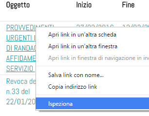
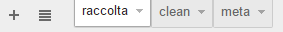
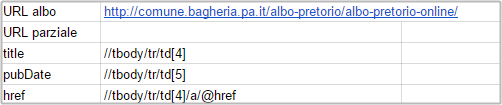
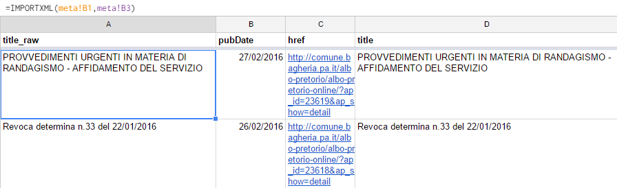

# Creare un feed RSS a partire dai contenuti di una pagina web, utilizzando il foglio elettronico di Google Drive

**Ingredienti**:

- una **pagina web** da cui estrarre i dati.

**Strumenti**:

- un **browser**;
- uno **[Sheet](https://www.google.com/intl/it_it/sheets/about/)**, ovvero il foglio elettronico di Google Drive;
- uno **script** scritto in **Google App Script**.

**Conoscenze propedeutiche**

- una conoscenza di base del linguaggio **HTML**;
- una conoscenza di base dei **feed RSS**;
- una conoscenza di base del linguaggio **XPath**;

**Difficoltà**: bassa

**Tempi di prepazione**: 20 minuti (salvo complicazioni)

**Dosi per**: da 1 a ∞ 

## Preparazione

### L'individuazione degli ingredienti

Si inizia dallo scegliere una pagina da trasformare in un feed RSS. Per questa ricetta, a solo scopo di esempio, utilizzeremo l'**albo Pretorio** del comun dei **Bagheria**:

http://comune.bagheria.pa.it/albo-pretorio/albo-pretorio-online/

La parte della pagina che contiene dei dati che si prestano a essere trasformati in un feed RSS è la tabella con gli atti pubblicati in atto, che ha una struttura come quella di sotto:

<table>
<thead>
<tr class="header">
<th align="left">Cronologico</th>
<th align="left">Ente</th>
<th align="left">Numero atto</th>
<th align="left">Oggetto</th>
<th align="left">Inizio</th>
<th align="left">Fine</th>
<th align="left">Categoria</th>
</tr>
</thead>
<tbody>
<tr class="odd">
<td align="left">728/2016</td>
<td align="left">Comune di Bagheria</td>
<td align="left">16</td>
<td align="left"><a href="http://comune.bagheria.pa.it/albo-pretorio/albo-pretorio-online/?ap_id=23619&amp;ap_show=detail">PROVVEDIMENTI URGENTI IN MATERIA DI RANDAGISMO - AFFIDAMENTO DEL SERVIZIO<br>
</a></td>
<td align="left">27/02/2016</td>
<td align="left">13/03/2016</td>
<td align="left">Determinazioni apicali - dirigenziali</td>
</tr>
<tr class="even">
<td align="left">727/2016</td>
<td align="left">Direzione 12. Minori, problematiche giovanili, disabili, dipendenze, sostegno al reddito e contrasto alla povertà, cultura valorizzazione beni culturali.</td>
<td align="left">225</td>
<td align="left"><a href="http://comune.bagheria.pa.it/albo-pretorio/albo-pretorio-online/?ap_id=23618&amp;ap_show=detail">Revoca determina n.33 del 22/01/2016<br>
</a></td>
<td align="left">26/02/2016</td>
<td align="left">12/03/2016</td>
<td align="left">Determinazioni apicali - dirigenziali</td>
</tr>
<tr class="odd">
<td align="left">726/2016</td>
<td align="left">DIREZIONE 7. Gare, Appalti e monitoraggio, patrimonio, sanità, espropri.</td>
<td align="left">48</td>
<td align="left"><a href="http://comune.bagheria.pa.it/albo-pretorio/albo-pretorio-online/?ap_id=23617&amp;ap_show=detail">Liquidazione pagamento canone affitto 2015 "La Pineta srl"<br>
</a></td>
<td align="left">26/02/2016</td>
<td align="left">12/03/2016</td>
<td align="left">Determinazioni apicali - dirigenziali</td>
</tr>
</tbody>
</table>

Per la creazione di un feed RSS gli elementi minimi da creare, e quindi estrarre sono:

- `<title>`, ovvero il titolo;
- `<pubDate>`, ovvero la data di pubblicazione;
- `<link>`, ovvero l'URL dell'elemento.

Per `<title>` e `<pubDate>`, per la tabella del nostro esempio, basterà estrarre rispettivamente il contenuto delle colonne "Oggetto" e "Inizio", ovvero la IV e la V. Per il link, bisognerà "guardare dentro" il codice HTML.
In corrispondenza dell'oggetto degli atti sembra esserci l'URL relativo, quindi bisognerà fare click con il desto del mouse sull'oggetto e poi fare click su ispeziona:



Guardando nel codice si vede una struttura di questo tipo:

```html
<td>
	<a href="http://comune.bagheria.pa.it/albo-pretorio/albo-pretorio-online/?ap_id=23619&amp;ap_show=detail" rel="nofollow">
	PROVVEDIMENTI URGENTI IN MATERIA DI RANDAGISMO - AFFIDAMENTO DEL SERVIZIO																			
	<br>
	</a>								
</td>
```

In questo esempio i dati che ci servono per il `<link>` del feed RSS sono quindi nella proprietà `href` del tag `a` associato ai titoli degli atti pubblicati.

### L'estrazione degli ingredienti

**Goodle Drive sheet** è lo strumento con cui "raccogliere" queste tre informazioni, tramite la funzione nativa [**IMPORTXML**](https://support.google.com/docs/answer/3093342?hl=it).  

La funzione "Importa dati dai vari tipi di dati strutturati, tra cui XML, HTML, CSV, TSV e feed XML RSS e ATOM", e richiede che vengano definite una fonte e una query XPATH. Ad esempio:

    IMPORTXML("https://it.wikipedia.org/wiki/Giochi_olimpici"; "//table[10]/tbody/tr/td[3]")

Nel caso di esempio la fonte è una e le query sono quelle della tabella sottostante:

Query|Descrizione|Elemento estratto
---|---|---
`//tbody/tr/td[4]`|Per la tabella presente, per tutte le righe, soltanto il contenuto delle celle della IV colonna|`<title>`
`//tbody/tr/td[5]`|Per la tabella presente, per tutte le righe, soltanto il contenuto delle celle della V colonna|`<pubDate>`
`//tbody/tr/td[4]/a/@href`|Per la tabella presente, per tutte le righe, soltanto per la IV colonna, la proprietà `href` di tutti i tag `<a>` contenuti|`<link>`

Non resta che aprire un foglio elettronico di Google Drive. Per facilitare l'apprendimento di questa ricetta, ne abbiamo già "cucinato" uno, raggiungibile [qui](https://docs.google.com/spreadsheets/d/1NdMuPWWXriStFn4P45ScYWkopIxTP2IrpIIOYX6Eeao/edit?usp=sharing).



E' suddiviso in tre fogli: 
- "**raccolta**", in cui vengono inseriti ed eventualmente "mondati" i dati estratti dalla pagina web sorgente;
- "**clean**", in cui sono presenti i soli necessari per la generazione del feed RSS; 
- "**meta**", un foglio in cui inserire alcuni metadati e istruzioni utili alla riuscita della ricetta.

Iniziamo proprio da "**meta**", in cui dovrà essere inserito l'URL della pagina sorgente e le 3 query XPath di sopra.



Nel foglio "**raccolta**" una riga di intestazione con i nomi di colonna ("title_raw", "pubDate", "href", "title") e nella seconda riga le funzioni per estrarre i valori di nostro interesse. In particolare:

Cella|Funzione
---|---
*A2*|`=IMPORTXML(meta!B1,meta!B3)`
*B2*|`=IMPORTXML(meta!B1,meta!B4)`
*C2*|`=IMPORTXML(meta!B1,meta!B5)`

Queste funzioni produrranno in automatico l'importazione per l'appunto di oggetto, data di pubblicazione e URL dell'atto.



Alle volte è necessario fare un po' di pulizia, e un foglio elettronico si presta bene per la "mondatura" di testi. Nella colonna "title", la IV, è stata inserita ad esempio una funziona che copia il titolo grezzo della fonte, e rimuove eventuali "andate a capo" presenti nel testo originario. La funzione usata è:

    =REGEXREPLACE(A2,"\n"," ")

Questa e tante altre operazioni propedeutiche alla pubblicazione in RSS possono essere fatte in questo foglio (rimozioni di caratteri non voluti, trasformazione in minuscolo, modifica dello schema della data da gg-mm-aaaa a gg/mm/aaaa, ecc.)

Non resta che importare nel foglio "**clean**" i soli dati necessari per produrre il feed RSS ovvero le colonne A, C e D. Per farlo un modo comodo è quello di usare la funzione [QUERY](https://support.google.com/docs/answer/3093343?hl=it-IT&rd=1), che richiede come argomenti una sorgente dati su cui fare l'interrogazione e la query da eseguire su questa.
Ad esempio, in questo caso, nella cella `A1` del foglio la formula:

    =QUERY(raccolta!A:D,"select D,B,C where C contains 'http'")

Ovvero a partire da tutto il range dei dati compreso tra le colonne "A" e "D" del foglio "raccolta", selezionare tutte le righe le colonne "D","B" e "C" laddove la colonna "C" contiene la stringa 'http'.

Una volta avuto il google sheet pulito e funzionante, consiglio di fare File --> Imposta Foglio di lavoro --> Ricalcolo e nel menù a tendina mettere "Ad ogni modifica e ad ogni ora".

Ora serve creare lo script per generare l'RSS automatico. Per fare questo bisogna :

1) creare lo script

2) personalizzarlo inserendo la KEY del foglio di calcolo sui cui deve lavorare

3) Pubblicarlo come Applicazione Web permettendo a "chiunque" di poterlo eseguire e settare il Trigger

4) Controllare se lo script funziona e il Feed RSS viene generato correttamente

5) Inserire il feed su servizi come www.feedburner.com e cosi normalizzare tutti i campi. 

6) Generare l'automa con IFTTT o Zapier per inviare gli items nuovi sul Canale Telegram o Twitter ect


Vediamo come procedere:

1) Strumenti --> Editor Script. Incollare [questo testo](https://docs.google.com/document/d/1MlF9mG6bB9Kam6p3m9MxJCS8fIayBAH6CNSRs8cySvk/edit?usp=sharing)

2) inserire la KEY nella riga commentata. Cliccare sull'icona del salvataggio e cliccare l'icona del Play oppure cliccare Esegui. Verrà chiesta l'autenticazione . Accettarla

3) Cliccare Risorse --> Trigger del progetto corrente --> aggiungere nuovo trigger con cadenza oraria. (è quello di default). Cliccare Pubblica --> distribuisci come applicazione web.Attenzione!! cliccare nel menu a tendina impostando "Chiunque, inclusi utenti anonimi".

4) Copiare il link creato da Google e incollarlo in una nuova finestra. E' tutto ok? E' un Feed RSS strutturato, con Title, Link e PubDate corretto? Complimenti! avete creato l'alboPop per il vostro Comune.

5) Andare su www.feedburner.com autenticandosi con il proprio account Google. Incollare il link dello script per punto 4) e creare il feed ridotto che sarà del tipo http://feeds.feedburner.com/AlboXXXX

6) sapete come fare :)


 **... to be continued ...**


